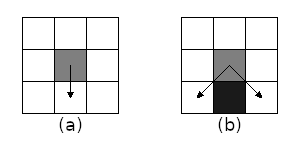
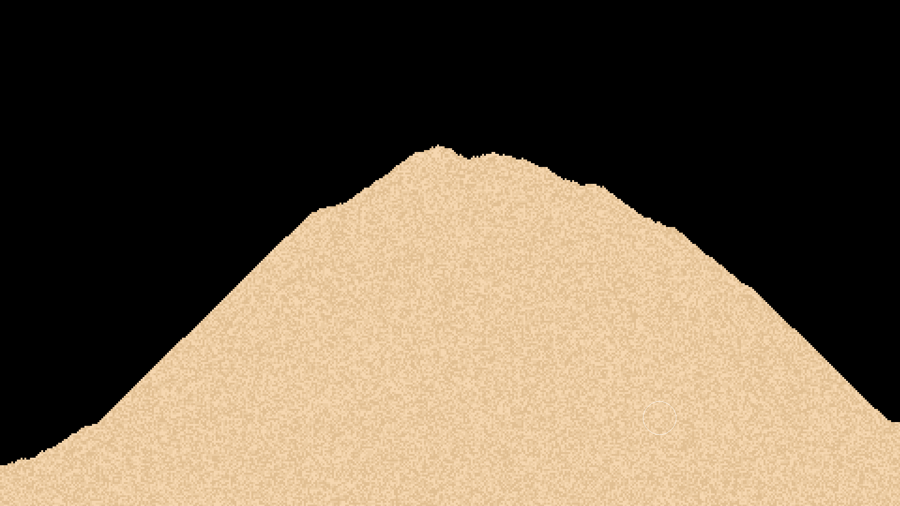
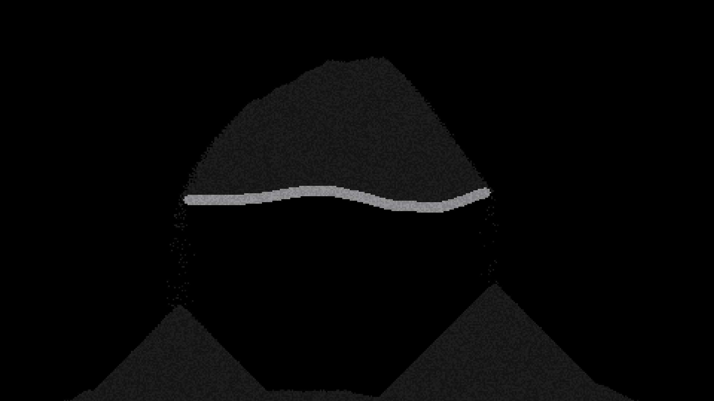
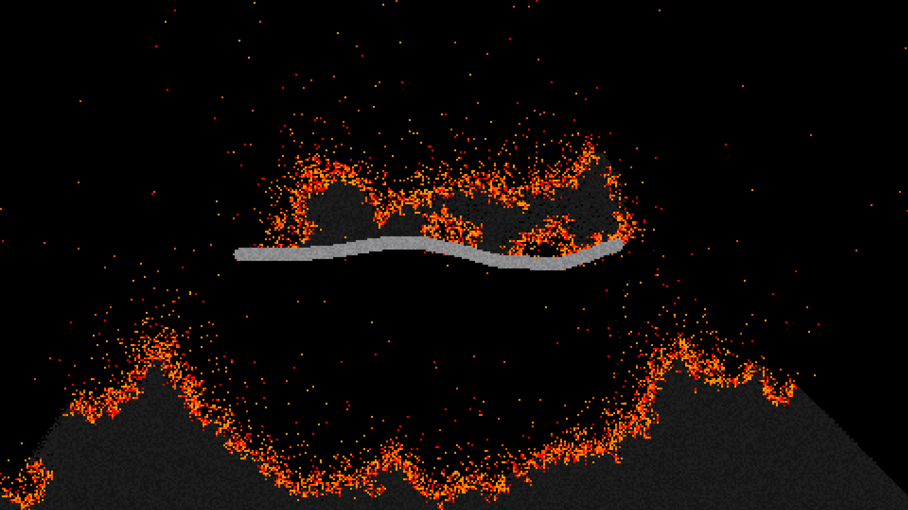

# Falling Sand Simulation (C++ and Python)

## Description
The goal of this project was to recreate the famous game **_Powder Toy_**. <br>
This simulation is of course way less complex than the original game, but it still has some interesting features. <br>

The first simulation is made in C++ using the SDL library for the graphics. <br>
The second simulation is made in Python using the Pygame library for the graphics. <br>

It's also worth noting that this README is mainly based on the C++ version of the project, as it is the one I spent the most time on. <br>
And not all things here apply to the Python version, like, for instance, the variables section.

## How to play
Just place the particles on the screen and watch them interact with each other. <br>
Place particle: [LEFT MOUSE BUTTON] <br>
Remove particle: [RIGHT MOUSE BUTTON] <br>
Change brush size: [SCROLL UP/DOWN] <br>
Change particle: [TAB] <br>
Pause/unpause simulation: [SPACE]

## Directory structure
- **.resources/** - Just a hidden folder containing some images used in this README.
- **screenshots/** - Contains some screenshots of the simulation.
- **src/** - Contains the source code for the C++ version.
- **python_src/** - Contains the source code for the Python version.
- **deps/** - Contains all external dependencies for the C++ version.
- **CMakeLists.txt** - The CMake file for building the C++ version.
- **cmake_modules/** - Contains some CMake modules used for building the C++ version.

It goes without saying that you can delete the screenshots and the .resources folders without affecting the actual project, if you so wish. <br>
But the rest of the folders are all required for the project to build properly.

## How to build (C++)
To build the project, you'll need to have a cmake installed. <br>
Once you have that, you can run the following commands in the terminal: <br>
```bash
mkdir build
cd build
cmake ..
cmake --build .
```
This will create an executable in the build folder. <br>
This is a cross-platform method, so it should work on both Linux and Windows, assuming you have a C++ compiler installed,
although on Windows, it seems to not work correctly unless you are using CLion for some reason.

## Variables
If you were to actually build the project yourself, there are a few constants that you can change in the code to alter the behavior of the simulation. <br>

Why would you want to do this? <br>
Well, because you can, of course. <br>

You can find the constants in the "src/globals.h" file. <br>
Here, you have constants such as:
- **WIDTH, HEIGHT** - The size of the window, in pixels.
- **PARTICLE_SIZE** - The size of each particle, in pixels.
- **TARGET_FPS** - The target framerate of the simulation.
- **GRAVITY** - The acceleration constant acting on the particles.

## How it works
Although it may seem complex, it is actually based on some simple rules. <br>
To sum it up, the game consists of a grid of particles, each particle having a color and a custom update function attached. <br>
The update function is called every frame, and it is responsible for the particle's behavior. <br>

The sand particle for instance, has a simple update function that checks first if there is an empty space below it, and if not, it checks down to the left, and if that also is taken, it checks down to the right... you get the idea. <br>
 <br>
It also has velocity, of course, which basically just changes how many iterations into the future it does at a time, also known as _interpolating_; <br>
so if the particle's velocity is 2, it will simulate it twice in a single update, making it fall twice as fast. <br>
At least that's the gist of it.

The fire is also quite simple, as the way it spreads is simply by checking the id of the surrounding particles, and if it is a flammable material, it will turn it into fire.

# More on the Python version
The Python version of this project is a lot simpler than the C++ version, as it is just a single file, and it doesn't have any of the fancy features that the C++ version has. <br>
The reason for this was because Python is hard to make these kinds of simulations in, as it is just _that_ slow, but also because I like C++ more, and put a lot more time into it that the Python version. <br>

The python version is _bad_, to say the least. <br>
And there were some things I needed to change from the C++ version in order to make it work. <br>
For instance, I couldn't use the updatedThisFrame variable, as it would be too slow; so instead, I opted to just limit the movement direction of the particles to only be down, this means fire is not possible in the current simulation. <br>

## The advantages of C++
Well, first of all, it is fast. <br>
Compared to the Python version of this project, which is noticeably dissimilar; this simulation runs at a much higher framerate. <br>
Not only that, but it also has a much higher resolution, and it can handle a lot more particles on the screen at the same time. <br>

This, combined with the fact that C++ has a lot more features than Python, like pointers, makes it a lot easier to implement new features. <br>

I will say however that Python is at a huge disadvantage here, as it isn't really meant for this kind of stuff. <br>
Sure, it is a lot easier to write code in Python in _some_ instances, and it _can_ be easier to debug, but it's also just so slow that you can barely do anything with it apart from simple calculations and data-visualization. <br>

## Conclusion
All in all, I think this project was a success. <br>
It was a lot of fun to make, and I learned a lot about these kinds of simulations in the process. <br>
I went through a lot of trial and error, and also a lot of iterations, but I think this is a good thing, as, just look at how much I have improved since the first version of this project. <br>
I also think that this project is a good example of how much of a difference the language you use can make, and how important it is to choose the right language for the job. <br>

## Screenshots




## Sources
During the making of this project, I used a lot of different sources to learn how to create a proper simulation. <br>
Among these sources are the following: <br>
- [The Powder Toy](https://powdertoy.co.uk/) - The original game that inspired this project.
- [Some random YouTube video](https://www.youtube.com/watch?v=VLZjd_Y1gJ8) - This video was the first thing I watched when I started this project, and it helped me understand the basics of how to create a simulation like this.
- [GitHub Copilot](https://copilot.github.com/) - I used this quite a bit, both for auto-completion, and for getting ideas on how to implement certain features.
